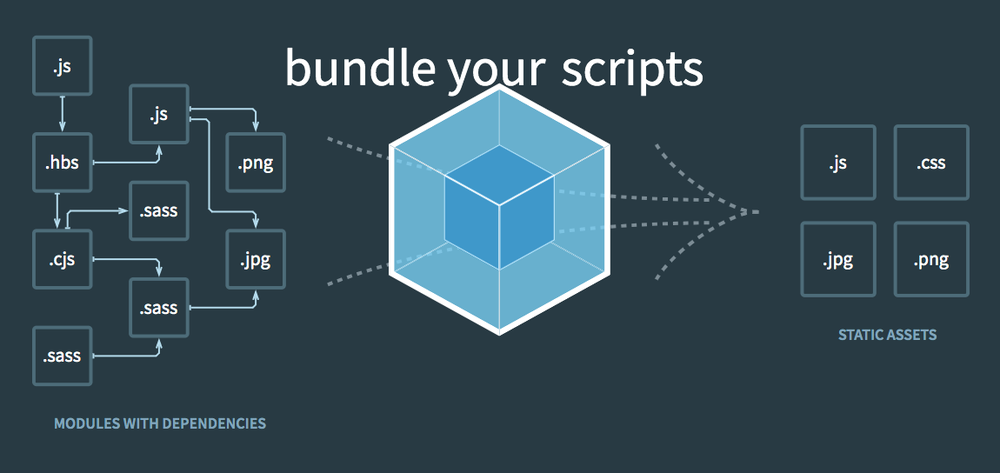
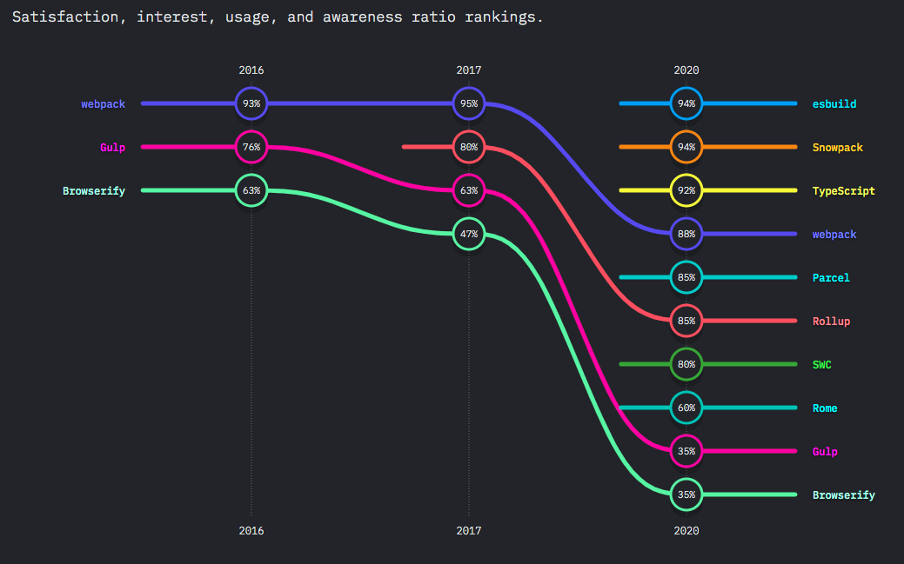

# webpack-cheatsheet
* it is one of javascript build tool

## vs react script
* Webpack is a general purpose bundler, not just for react
* with react project, `react script` will be easier to set up than webpack
  * we need to add other plugins required by Webpack to support some features
* `react script` uses webpack internally
* When to use webpack?
  * write a component library to reuse in other apps
  * want to build browser specific bundles of your JS, a smaller bundle for newer browsers without transpilation and polyfills, and a fatter bundle for older browsers containing all of those

